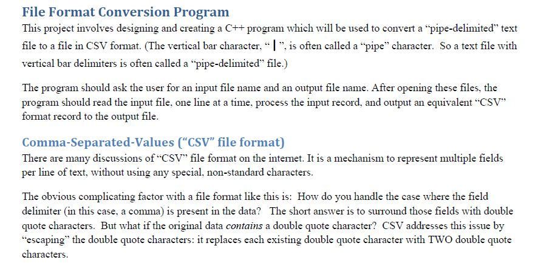
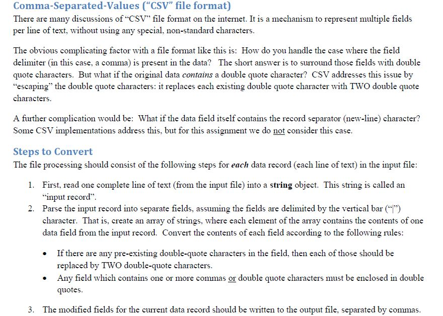
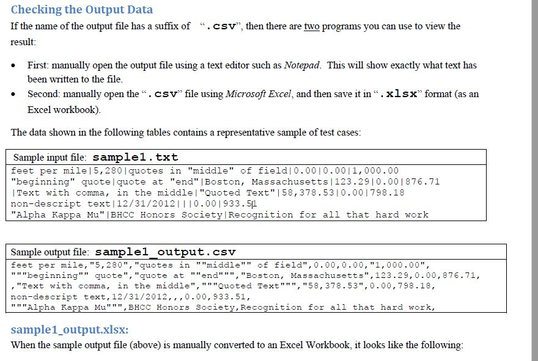
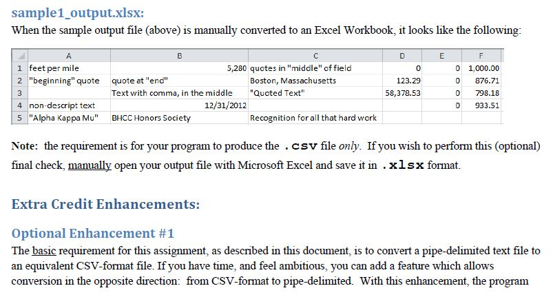

# File-FormaConversionCsvTxt

This project involves designing and creating a C++ program which will be used to convert a “pipe-delimited” text file 
to a file in CSV format and a conversion in the opposite direction: from CSV-format to pipe-delimited. Giving the user
an option of specifying a different delimiter character, instead of the vertical bar (“|”) delimiter character.
These are more detailed steps to using this program:

